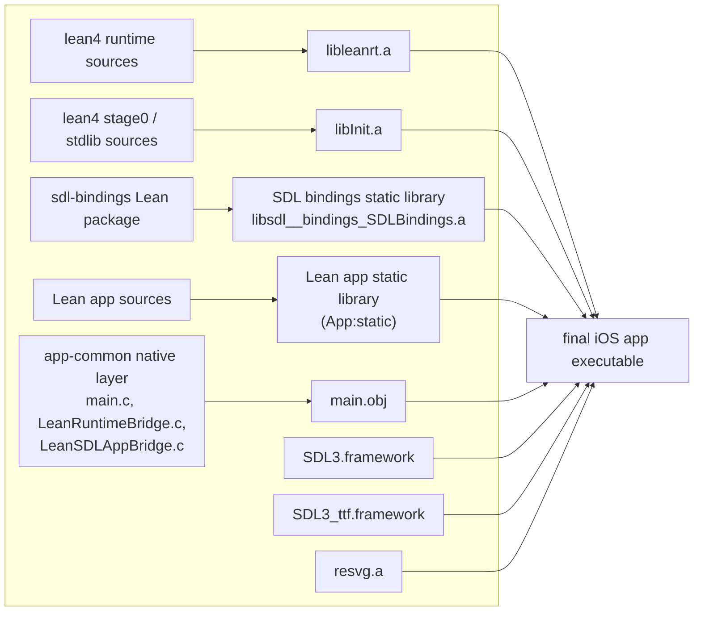

# Project Architecture

```mermaid
%%{init: {
  "flowchart": { "useMaxWidth": true, "nodeSpacing": 25, "rankSpacing": 45 },
  "themeVariables": {
    "fontSize": "24px",
    "primaryTextColor": "#111111",
    "lineColor": "#333333"
  }
}}%%

flowchart LR
  subgraph Left[" "]
    direction TB
    RuntimeSrc["lean4 runtime sources"]
    RuntimeLib["libleanrt.a"]
    Stage0Src["lean4 stage0 / stdlib sources"]
    InitLib["libInit.a"]
    SDLBindingsLean["sdl-bindings Lean package"]
    SDLBindingsLib["SDL bindings static library\nlibsdl__bindings_SDLBindings.a"]
    LeanSources["Lean app sources"]
    AppStatic["Lean app static library\n(App:static)"]
    CommonNative["app-common native layer\nmain.c, LeanRuntimeBridge.c,\nLeanSDLAppBridge.c"]
		CommonNativeObj["main.obj"]
    SDL3["SDL3.framework"]
    SDLTTF["SDL3_ttf.framework"]
    Resvg["resvg.a"]
  end

  Final["final iOS app executable"]

  RuntimeSrc --> RuntimeLib
  Stage0Src --> InitLib
  SDLBindingsLean --> SDLBindingsLib
  LeanSources --> AppStatic
	CommonNative --> CommonNativeObj

  RuntimeLib --> Final
  InitLib --> Final
  SDLBindingsLib --> Final
  AppStatic --> Final
  CommonNativeObj --> Final
  SDL3 --> Final
  SDLTTF --> Final
  Resvg --> Final
```
